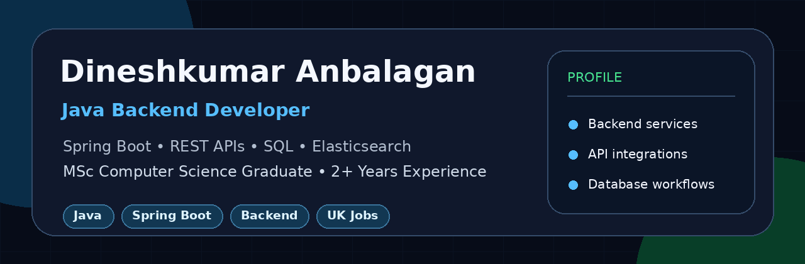

<h1 align="center">Hi, I'm Dineshkumar Anbalagan 👋</h1>

  

<h3 align="center">Java Backend Developer | Spring Boot | REST APIs | PostgreSQL | Elasticsearch</h3>

---

 About Me

I am a Java Backend Developer with 2+ years of experience in logistics and real estate domains. I recently completed my MSc Computer Science from the University of Hertfordshire, UK.

I enjoy building backend services, REST APIs, database-driven applications, search features, and scalable service integrations.

---

 Tech Stack

- Java
- Spring Boot
- REST APIs
- PostgreSQL / MySQL
- MyBatis / Hibernate
- Elasticsearch
- Flyway
- RabbitMQ / Kafka
- Docker
- Jenkins / GitHub Actions
- JUnit / Mockito

---

 Featured Project

Dynamic Shipment Orchestration Backend

A Java Spring Boot backend project using a ServiceBus/Orchestrator pattern to dynamically route requests to database, search, and reporting services.

Tech used: Java 17, Spring Boot, PostgreSQL, MyBatis, Flyway, Elasticsearch, JasperReports.

---

Connect With Me

- LinkedIn: https://www.linkedin.com/in/Dinesh-kumar-Anbalagan
- Email: dineshkumar15.anbalagan@gmail.com
